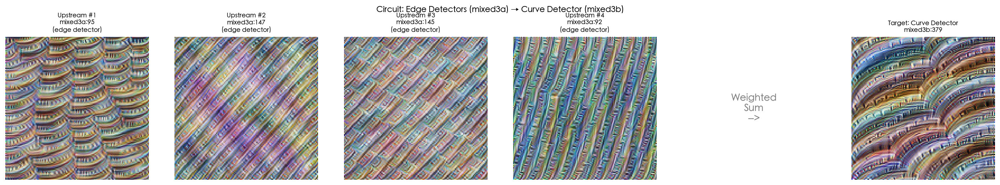
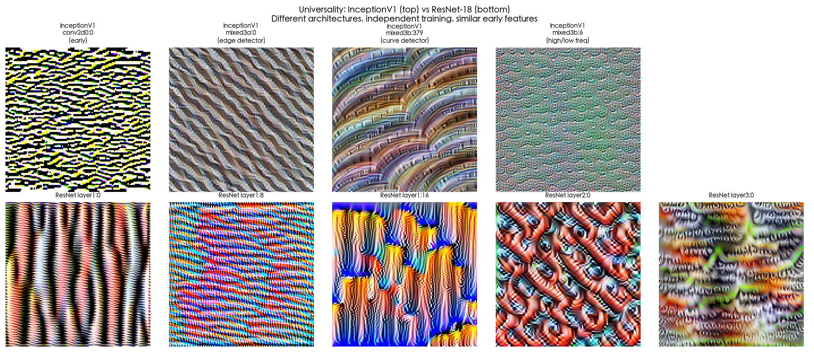

# Circuits: Zoom In — 动手教程

[**English README**](README.md) ·
[](https://colab.research.google.com/github/Jonny-English/circuits-zoom-in/blob/main/notebooks/circuits_zoom_in_zh.ipynb)
[](LICENSE)
[](https://www.python.org/downloads/)

<p align="center">
  
  &nbsp;&nbsp;
  
</p>
<p align="center">
  
  &nbsp;&nbsp;
  
</p>

## 这个项目在做什么

2020 年，Chris Olah 和他在 OpenAI 的同事们发表了一篇改变了许多人对神经网络认知的论文。论文的核心论点朴素得令人意外：如果你足够仔细地观察视觉模型内部的权重和激活值，你会发现单个神经元在检测有意义的特征，这些神经元通过权重连接形成可解释的电路，而且相同的特征和电路会在完全不同的架构中反复出现。他们把这篇论文叫做《[Zoom In: An Introduction to Circuits](https://distill.pub/2020/circuits/zoom-in/)》。

这个仓库是我从零开始复现那些核心实验的尝试，并且刻意用中文来写——每一个变量都用中文命名，每一段解释都先用中文写成。这不是为了标新立异。当你读到 `shape_record` 的时候，你的眼睛可能会把它当作一个熟悉的编程符号滑过去，而不去思考它到底代表什么。但当你读到 `形状记录` 的时候，你不得不停下来想一想：这个东西记录的是什么形状，为什么要记录它。中文变量名是一种教学手段——它让你在恰当的地方慢下来。

## 你将学到什么

Notebook 按顺序走过六个实验，每一个都建立在前一个的基础上：

| 章节 | 做了什么 | 为什么重要 |
|------|---------|-----------|
| §2 特征可视化 | 从随机噪声出发，用梯度上升迭代修改图片，让单个神经元的激活值最大化。 | 这是我们向一个神经元提问的方式：*你在找什么？* 答案以图片的形式呈现，往往是清晰可辨的曲线、边缘、纹理，甚至物体的碎片。 |
| §3 数据集验证 | 在真实图片数据集（CIFAR-10）中搜索最能激活同一个神经元的照片。 | 合成优化图片可能会误导人。如果让神经元兴奋的真实照片和优化图片在视觉上相似，我们就有理由相信这个神经元在检测一种真实的视觉模式，而不是优化过程的伪影。 |
| §4 方向调谐 | 生成 36 个不同方向的合成弧线刺激，测量神经元激活值随角度的变化，绘制极坐标图。 | 这个实验把机器学习和视觉神经科学直接联系起来：InceptionV1 中的曲线探测器表现出的方向选择性，与灵长类视觉皮层 V1 区简单细胞的行为惊人地相似。 |
| §5 电路分析 | 直接读取权重矩阵，追踪 `mixed3b` 中的曲线探测器是如何由 `mixed3a` 中的边缘探测器加权组合而来的。 | 这是电路假说的核心。曲线不是凭空被检测到的——它是通过学到的权重，从上游的边缘探测器*计算*出来的。 |
| §6 普遍性 | 在 ResNet-18——一个完全不同的架构、独立训练的模型——上重复特征可视化，比较结果。 | 如果除了训练数据之外毫无共同点的网络中出现了相同类型的特征，那这些特征就不是架构的偶然产物，而更接近于学习到的视觉表征的自然词汇。 |
| §7 局限性 | 讨论本教程*没有*展示的东西：多义性、非线性交互，以及视觉电路与当前主流 Transformer 电路研究之间的鸿沟。 | 诚实地承认局限性不是教程的弱点——它是为读者指明下一步方向的路标。 |

## 为什么做这个项目

越来越多的中文使用者希望理解机械可解释性——这个致力于逆向工程神经网络到底学到了什么的 AI 安全子领域。但基础论文全是英文的，代码注释是英文的，变量名也是英文的。对于中文母语者来说，学习这些概念意味着同时穿越一门外语和一套外来的抽象体系。

这个教程选择了不同的路径。它不需要 GPU，在 CPU 上就能完整运行。它支持 Google Colab 一键打开。它在一台普通笔记本上大约十五分钟就能跑完。入门的门槛，被压到了我能做到的最低。

## 快速开始

```bash
git clone https://github.com/Jonny-English/circuits-zoom-in.git
cd circuits-zoom-in
pip install -r requirements.txt

# 选择你的语言
jupyter notebook notebooks/circuits_zoom_in_zh.ipynb  # 中文
jupyter notebook notebooks/circuits_zoom_in_en.ipynb  # English
```

或者直接点击页面顶部的 **Open in Colab** 徽章。

## 项目结构

```
circuits-zoom-in/
├── notebooks/
│   ├── circuits_zoom_in_zh.ipynb   # 中文版
│   └── circuits_zoom_in_en.ipynb   # English version
├── figures/                        # README 展示用的预渲染图片
├── scripts/                        # 图片生成与工具脚本
├── requirements.txt
├── pyproject.toml
├── CITATION.cff
├── CONTRIBUTING.md
└── LICENSE
```

## 引用

如果这个教程对你的工作有帮助：

```bibtex
@software{circuits_zoom_in_tutorial,
  title  = {Circuits: Zoom In — A Hands-On Tutorial},
  author = {Jonny-English},
  year   = {2026},
  url    = {https://github.com/Jonny-English/circuits-zoom-in},
  license = {MIT}
}
```

## 致谢

这个教程的存在，首先要感谢 Chris Olah、Nick Cammarata、Ludwig Schubert、Gabriel Goh、Michael Petrov 和 Shan Carter 的原始论文 [Zoom In](https://distill.pub/2020/circuits/zoom-in/)。开源社区维护的 [lucent](https://github.com/greentfrapp/lucent) 库让 PyTorch 中的特征可视化变得简单直接。而 [Distill](https://distill.pub/) 期刊——虽然已经停刊，但影响力依然深远——定义了清晰、诚实、视觉丰富的科学传播应当是什么样子。

## 许可证

[MIT](LICENSE)
